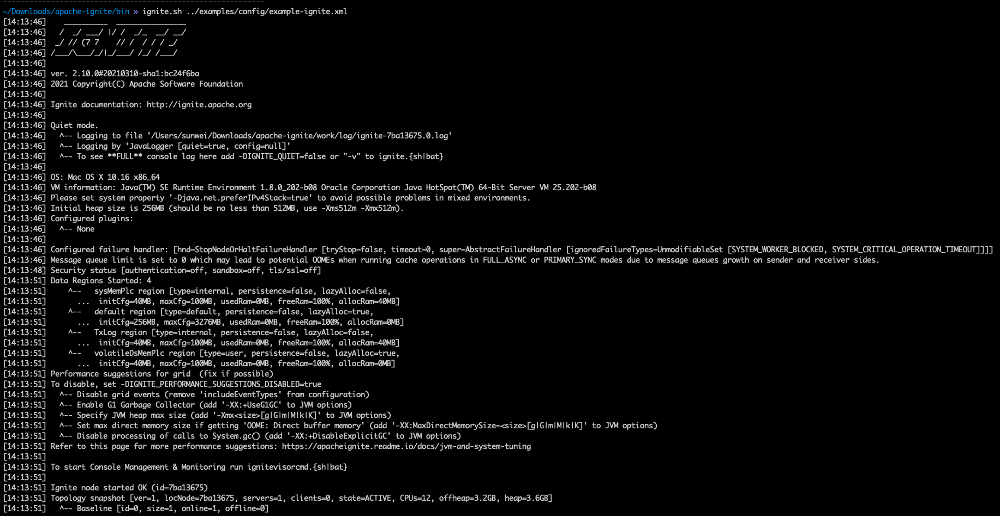

# ignite 学习

### 下载地址

https://ignite.apache.org/download.cgi#sources

### 启动 ignite

#### 参见文档 https://ignite.apache.org/docs/latest/quick-start/java

#### 示例

#### 客户端配置

    IgniteConfig

##### 基本方法操作

    IgniteCacheController
   

 

